# Class Diagram — Java Types

Java classes of `com.wallaceespindola.dbmigration`: configuration, services, controllers, DTOs and the
`MigrationEngine` enum. `MigrationHistoryProvider` is the only interface in the codebase and it has exactly two
implementations, one per migration engine.

Source: `src/main/java/com/wallaceespindola/dbmigration`

```mermaid
classDiagram
    direction TB

    class DbMigrationComparisonApplication {
        <<SpringBootApplication>>
        +main(args) void$
    }

    %% ---------- config ----------
    class FlywayConfig {
        <<Configuration>>
        +String DATA_SOURCE$
        +String JDBC_TEMPLATE$
        -String locations
        -boolean baselineOnMigrate
        +flywayDataSourceProperties() DataSourceProperties
        +flywayDataSource(properties) DataSource
        +flyway(dataSource) Flyway
        +flywayJdbcTemplate(dataSource) JdbcTemplate
    }

    class LiquibaseConfig {
        <<Configuration>>
        +String DATA_SOURCE$
        +String JDBC_TEMPLATE$
        -String changeLog
        -String contexts
        -String defaultSchema
        +liquibaseDataSourceProperties() DataSourceProperties
        +liquibaseDataSource(properties) DataSource
        +liquibase(dataSource) SpringLiquibase
        +liquibaseJdbcTemplate(dataSource) JdbcTemplate
    }

    class OpenApiConfig {
        <<Configuration>>
        +dbMigrationOpenApi() OpenAPI
    }

    %% ---------- domain ----------
    class MigrationEngine {
        <<enumeration>>
        FLYWAY
        LIQUIBASE
        +displayName() String
        +historyTable() String
        +model() String
        +from(value) MigrationEngine$
    }

    %% ---------- service ----------
    class MigrationHistoryProvider {
        <<interface>>
        +engine() MigrationEngine
        +status() MigrationStatusReport
    }

    class FlywayHistoryService {
        <<Service>>
        -String NO_AUTHOR$
        -Flyway flyway
        +engine() MigrationEngine
        +status() MigrationStatusReport
        -toAppliedMigration(info) AppliedMigration$
    }

    class LiquibaseHistoryService {
        <<Service>>
        -String HISTORY_QUERY$
        -RowMapper CHANGELOG_ROW_MAPPER$
        -JdbcTemplate jdbcTemplate
        +engine() MigrationEngine
        +status() MigrationStatusReport
        -describe(resultSet) String$
    }

    class SchemaInspectionService {
        <<Service>>
        -Set BOOKKEEPING_TABLES$
        -String SCHEMA$
        -String TABLES_QUERY$
        -String VIEWS_QUERY$
        -String COLUMNS_QUERY$
        -String INDEXES_QUERY$
        -String CATALOG_QUERY$
        -Map templates
        +snapshot(engine) SchemaSnapshot
        +catalog(engine) List
        -templateFor(engine) JdbcTemplate
        -isBookkeeping(tableName) boolean$
    }

    class ComparisonService {
        <<Service>>
        -Map providers
        -SchemaInspectionService schemaInspection
        +status(engine) MigrationStatusReport
        +schema(engine) SchemaSnapshot
        +compare() ComparisonReport
        ~diff(flyway, liquibase) List$
        -compareSets(kind, flywayItems, liquibaseItems, sink) void$
    }

    class FeatureMatrix {
        <<final utility>>
        -List ROWS$
        +rows() List$
    }

    %% ---------- controller ----------
    class MigrationController {
        <<RestController>>
        -ComparisonService comparisonService
        +statusForBothEngines() ResponseEntity
        +engines() ResponseEntity
        +status(engine) ResponseEntity
        +schema(engine) ResponseEntity
    }

    class ComparisonController {
        <<RestController>>
        -ComparisonService comparisonService
        +compare() ResponseEntity
        +features() ResponseEntity
    }

    class CatalogController {
        <<RestController>>
        -SchemaInspectionService schemaInspectionService
        +catalog(engine) ResponseEntity
    }

    class HealthController {
        <<RestController>>
        -ComparisonService comparisonService
        +health() ResponseEntity
    }

    class GlobalExceptionHandler {
        <<RestControllerAdvice>>
        +handleBadRequest(e) ResponseEntity
        +handleDataAccess(e) ResponseEntity
        +handleUnexpected(e) ResponseEntity
    }

    %% ---------- dto ----------
    class ApiResponse~T~ {
        <<record>>
    }
    class ComparisonReport {
        <<record>>
    }
    class MigrationStatusReport {
        <<record>>
    }
    class AppliedMigration {
        <<record>>
    }
    class SchemaSnapshot {
        <<record>>
    }
    class ProductView {
        <<record>>
    }
    class FeatureComparison {
        <<record>>
    }

    %% ---------- external ----------
    class Flyway {
        <<external>>
        +info() MigrationInfoService
        +migrate() MigrateResult
    }
    class SpringLiquibase {
        <<external>>
        +afterPropertiesSet() void
    }
    class JdbcTemplate {
        <<external>>
    }

    %% ---------- relationships ----------
    MigrationHistoryProvider <|.. FlywayHistoryService
    MigrationHistoryProvider <|.. LiquibaseHistoryService

    FlywayConfig ..> Flyway : creates with initMethod migrate
    FlywayConfig ..> JdbcTemplate : creates flywayJdbcTemplate
    LiquibaseConfig ..> SpringLiquibase : creates
    LiquibaseConfig ..> JdbcTemplate : creates liquibaseJdbcTemplate

    FlywayHistoryService --> Flyway : reads history via info
    LiquibaseHistoryService --> JdbcTemplate : queries DATABASECHANGELOG
    SchemaInspectionService --> JdbcTemplate : holds both templates

    ComparisonService o-- MigrationHistoryProvider : 2 implementations
    ComparisonService --> SchemaInspectionService
    ComparisonService ..> FeatureMatrix
    ComparisonService ..> ComparisonReport

    MigrationController --> ComparisonService
    ComparisonController --> ComparisonService
    ComparisonController ..> FeatureMatrix
    CatalogController --> SchemaInspectionService
    HealthController --> ComparisonService
    GlobalExceptionHandler ..> ApiResponse

    MigrationHistoryProvider ..> MigrationEngine
    FlywayHistoryService ..> MigrationStatusReport
    LiquibaseHistoryService ..> MigrationStatusReport
    SchemaInspectionService ..> SchemaSnapshot
    SchemaInspectionService ..> ProductView
    MigrationStatusReport o-- AppliedMigration
    MigrationStatusReport --> MigrationEngine
    SchemaSnapshot --> MigrationEngine
    FeatureMatrix o-- FeatureComparison : 18 rows
    ComparisonReport o-- MigrationStatusReport : 2
    ComparisonReport o-- SchemaSnapshot : 2
    ComparisonReport o-- FeatureComparison
```

Notes read from the source:

- `FlywayHistoryService` depends on the `Flyway` bean itself and uses `flyway.info().all()`. It issues no SQL.
- `LiquibaseHistoryService` depends on `liquibaseJdbcTemplate` and runs a `SELECT` against `DATABASECHANGELOG`,
  because Liquibase exposes no equivalent read-only status API for embedded use.
- `ComparisonService` receives `List<MigrationHistoryProvider>` from the Spring context and indexes it into an
  `EnumMap` keyed by `MigrationEngine`.
- `SchemaInspectionService` is the only bean holding both `JdbcTemplate`s, in a
  `Map<MigrationEngine, JdbcTemplate>` built in the constructor.
- `FeatureMatrix` is a final utility class with a private throwing constructor; its 18 rows are static data.
- `ComparisonService.diff` and `compareSets` are package-private and static — they are unit-testable without the
  Spring context.

Author: Wallace Espindola — [github.com/wallaceespindola](https://github.com/wallaceespindola/) ·
[linkedin.com/in/wallaceespindola](https://www.linkedin.com/in/wallaceespindola/)
