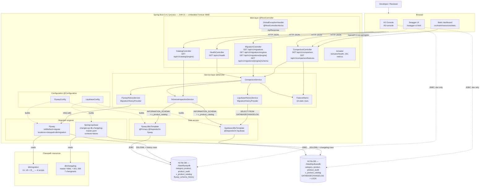

# Component Diagram — C4 Container / Component View

One Spring Boot process serves the REST API and owns both migration engines. Each engine has its own
`DataSource`, its own `JdbcTemplate` and its own H2 file database. Nothing is shared between the two sides except
the JVM and the service classes that read from both.

Source: `config/`, `controller/`, `service/`, `application.yml`

Key structural points:

- `DataSourceAutoConfiguration` is excluded in `application.yml`. Both `DataSource` beans are declared explicitly,
  so there is no ambiguity about which engine touches which database.
- The Flyway side is `@Primary` (`flywayDataSourceProperties`, `flywayDataSource`, `flywayJdbcTemplate`); the
  Liquibase side is resolved by `@Qualifier`.
- `SchemaInspectionService` is the only component holding both `JdbcTemplate`s, in a
  `Map<MigrationEngine, JdbcTemplate>`.
- The static dashboard lives in `src/main/resources/static` (`index.html`, `css/styles.css`, `js/app.js`) and is
  served by the same Spring Boot process on port 8080. It calls `/api/v1/comparison` and `/api/v1/catalog/{engine}`.
  Swagger UI is available alongside it at `/swagger-ui.html`.

Author: Wallace Espindola — [github.com/wallaceespindola](https://github.com/wallaceespindola/) ·
[linkedin.com/in/wallaceespindola](https://www.linkedin.com/in/wallaceespindola/)
