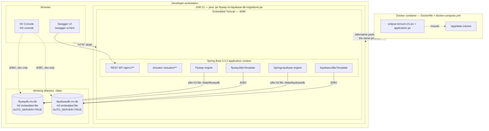

# Deployment Diagram

A single JVM process. Embedded Tomcat on port 8080, two H2 file databases under `./data` relative to the working
directory. No external database server, no network hop between the application and its storage.

Source: `application.yml` (`app.datasource.*.url`, `server.port`), `pom.xml` (Spring Boot 3.4.2, Java 21)

Operational notes:

- Migrations execute during application-context refresh, before Tomcat starts accepting requests. A failed
  migration fails startup; the process never serves a partially migrated database.
- `AUTO_SERVER=TRUE` allows a second local process (for example an IDE or the H2 console) to open the same file
  while the application holds it.
- `DB_CLOSE_DELAY=-1` keeps the in-JVM database open until the JVM exits.
- Deleting `./data` resets both engines. Flyway then re-runs V1..V5 and R__; Liquibase re-runs all 7 changesets.
- The Docker box is dashed on purpose: there is no `Dockerfile` or `docker-compose.yml` in the repository yet. If
  added, `./data` must be a mounted volume or both databases are lost on every container restart.

Author: Wallace Espindola — [github.com/wallaceespindola](https://github.com/wallaceespindola/) ·
[linkedin.com/in/wallaceespindola](https://www.linkedin.com/in/wallaceespindola/)
