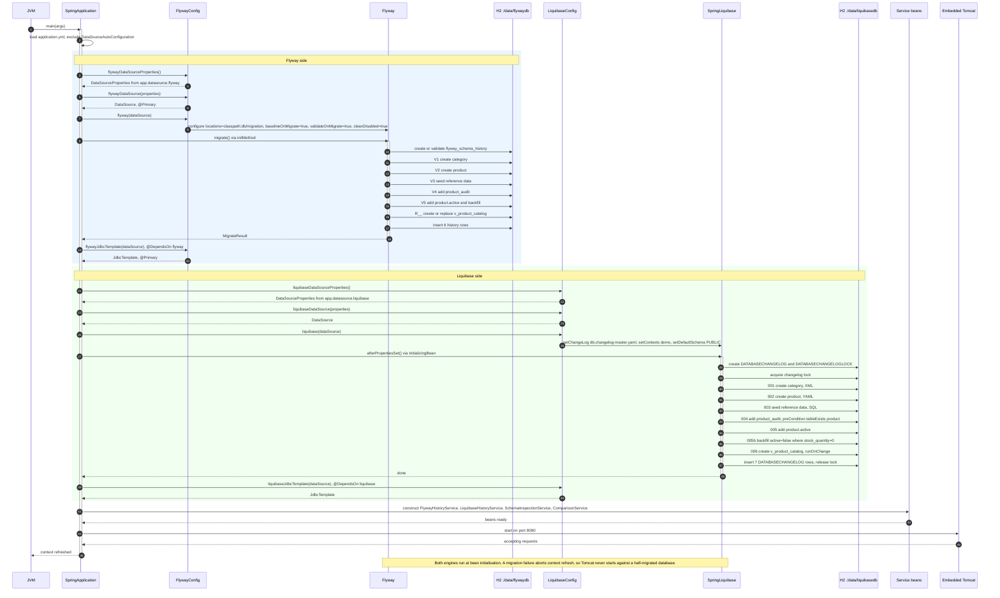
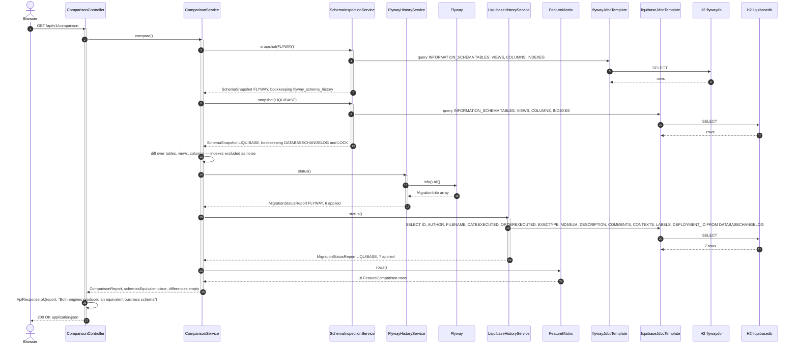
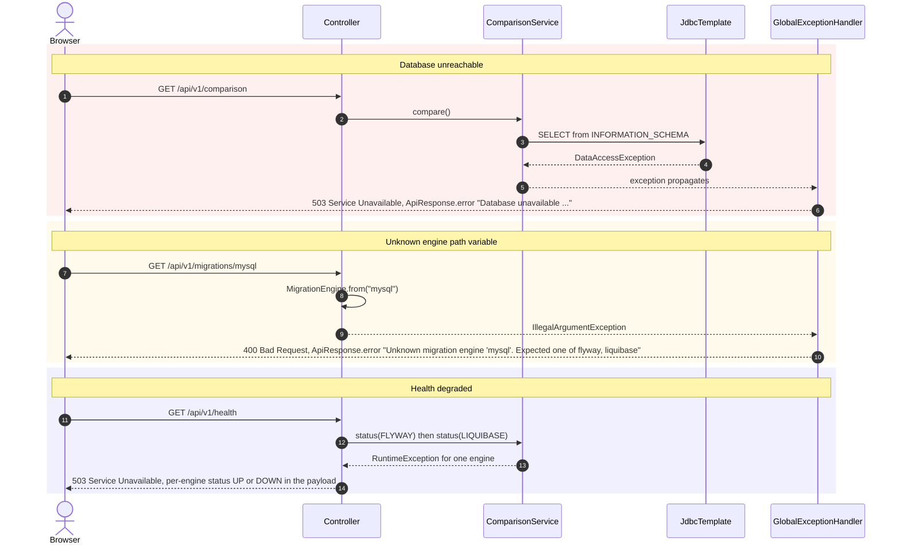

# Sequence Diagrams

Two flows: application startup, where both engines migrate their own database during context refresh, and the
`GET /api/v1/comparison` request, which is the endpoint the whole project exists to serve.

Source: `config/FlywayConfig.java`, `config/LiquibaseConfig.java`, `service/ComparisonService.java`,
`controller/ComparisonController.java`

## 1. Startup — both engines migrate during context refresh

## 2. Request — GET /api/v1/comparison

## 3. Failure paths

Author: Wallace Espindola — [github.com/wallaceespindola](https://github.com/wallaceespindola/) ·
[linkedin.com/in/wallaceespindola](https://www.linkedin.com/in/wallaceespindola/)
