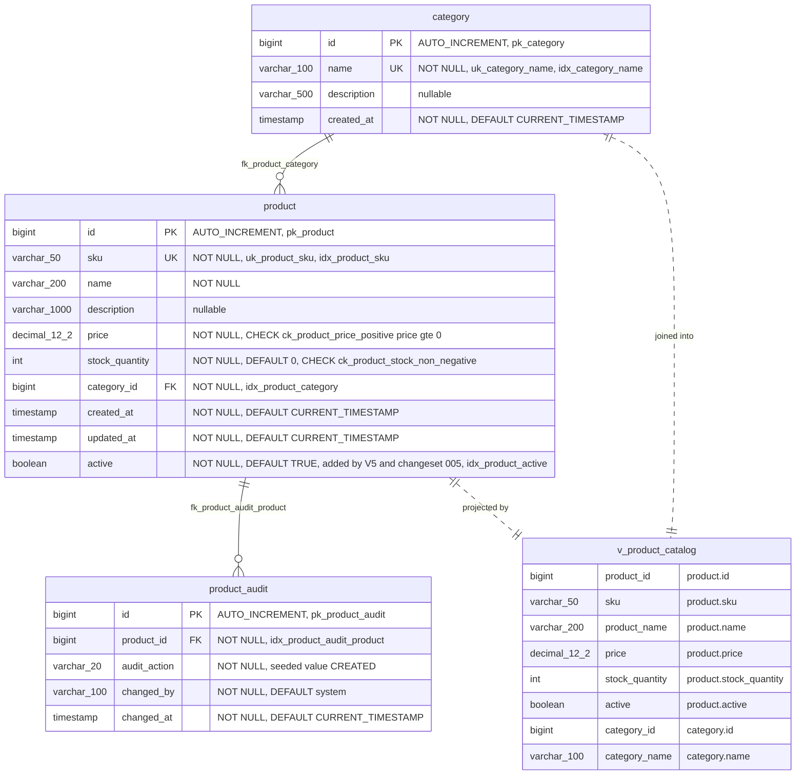
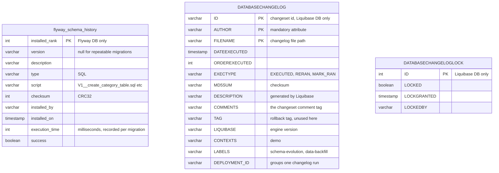

# Entity Relationship Diagram

The business schema is identical in both databases. Flyway builds it with `V1..V5` plus one repeatable script;
Liquibase builds it with changesets `001..006`. Column names, types, constraints and index names match on both
sides — that equivalence is what `GET /api/v1/comparison` verifies at runtime.

Source: `src/main/resources/db/migration/*.sql`, `src/main/resources/db/changelog/changes/*`

Mermaid ERD attribute types are written with underscores because the notation does not accept parentheses.
`varchar_100` means `VARCHAR(100)`; `decimal_12_2` means `DECIMAL(12,2)`.

## 1. Business schema — identical in `./data/flywaydb` and `./data/liquibasedb`



View definition, identical on both sides:

```sql
SELECT p.id AS product_id, p.sku AS sku, p.name AS product_name,
       p.price AS price, p.stock_quantity AS stock_quantity, p.active AS active,
       c.id AS category_id, c.name AS category_name
FROM product p
JOIN category c ON c.id = p.category_id;
```

Flyway declares it in `R__product_catalog_view.sql` (`CREATE OR REPLACE VIEW`, re-run when the checksum changes).
Liquibase declares it in `006-product-catalog-view.xml` (`createView replaceIfExists="true"` with
`runOnChange="true"`). Same semantics, different declaration site.

## 2. Bookkeeping tables — the only structural difference



Row counts after a clean startup:

| Database | Bookkeeping table | Rows | Entries |
|---|---|---|---|
| `./data/flywaydb` | `flyway_schema_history` | 6 | `V1`, `V2`, `V3`, `V4`, `V5`, `R__product_catalog_view` |
| `./data/liquibasedb` | `DATABASECHANGELOG` | 7 | `001`, `002`, `003`, `004`, `005`, `005b`, `006` |
| `./data/liquibasedb` | `DATABASECHANGELOGLOCK` | 1 | lock row, `LOCKED = false` when idle |

The count differs because `005-add-product-active-flag.xml` splits the expand step and the data backfill into two
changesets (`005` and `005b`), while Flyway's `V5__add_product_active_flag.sql` performs both in one script.
`SchemaInspectionService.BOOKKEEPING_TABLES` excludes all three tables from the diff, which is why the comparison
reports zero structural differences.

## 3. Migration script to changeset mapping

| Schema change | Flyway | Liquibase | Format |
|---|---|---|---|
| `category` table + `idx_category_name` | `V1__create_category_table.sql` | `001-create-category-table.xml` | SQL vs XML |
| `product` table, FKs, checks, 2 indexes | `V2__create_product_table.sql` | `002-create-product-table.yaml` | SQL vs YAML plus one raw `sql` tag for the check constraints |
| 3 categories + 5 products seeded | `V3__seed_reference_data.sql` | `003-seed-reference-data.sql` | SQL vs Liquibase formatted SQL |
| `product_audit` table + backfill | `V4__add_product_audit_table.sql` | `004-add-product-audit-table.xml` | Liquibase adds `preConditions onFail=MARK_RAN` and an explicit `rollback` |
| `product.active` + backfill + index | `V5__add_product_active_flag.sql` | `005-add-product-active-flag.xml` | Liquibase splits into `005` and `005b`, both with `context=demo` and labels |
| `v_product_catalog` view | `R__product_catalog_view.sql` | `006-product-catalog-view.xml` | repeatable by filename vs `runOnChange="true"` |

`changed_by` in `product_audit` differs in seeded *data*, not in structure: Flyway inserts `flyway-migration`,
Liquibase inserts `liquibase-changeset`. The schema diff only compares structure, so this is not reported as a
difference.

Author: Wallace Espindola — [github.com/wallaceespindola](https://github.com/wallaceespindola/) ·
[linkedin.com/in/wallaceespindola](https://www.linkedin.com/in/wallaceespindola/)
