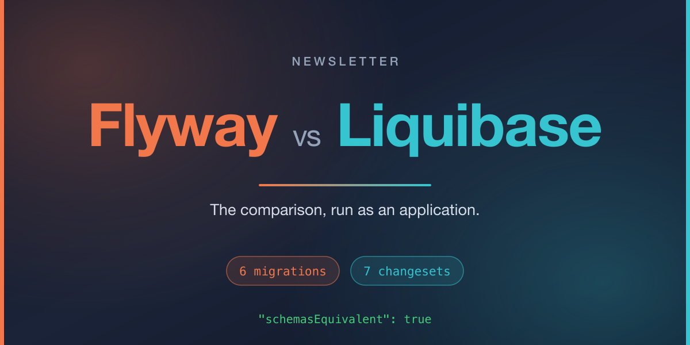

# Images

## Article banners

One banner per publishing platform, each rendered at that platform's native cover ratio so the CMS
crops as little as possible.

| File | Size | Used by |
| --- | --- | --- |
| `banner-dzone.png` | 1200×628 | [DZone article](../articles/dzone-flyway-vs-liquibase.md) |
| `banner-medium.png` | 1400×700 | [Medium article](../articles/medium-flyway-vs-liquibase.md) |
| `banner-devto.png` | 1000×420 | [Dev.to article](../articles/devto-flyway-vs-liquibase.md) — via the `cover_image` front-matter field |
| `banner-linkedin.png` | 1280×720 | [LinkedIn article](../articles/linkedin-flyway-vs-liquibase.md) |
| `banner-substack.png` | 1200×600 | [Substack issue](../articles/substack-flyway-vs-liquibase.md) |



The palette is taken from the dashboard stylesheet (`src/main/resources/static/css/styles.css`) —
slate background, Flyway orange `#f2784b`, Liquibase teal `#35c4d0` — so the articles and the running
application read as one project. The two chips carry the real applied counts (6 and 7), and the
footer line is the actual field name the comparison endpoint returns.

### Regenerating

Both the `.svg` sources and the `.png` output are generated, and both are committed so the repo does
not need the toolchain just to render. To change them, edit `generate_banners.py` and re-run it:

```bash
python3 docs/images/generate_banners.py
```

Requires `rsvg-convert` (librsvg):

```bash
brew install librsvg          # macOS
sudo apt install librsvg2-bin # Debian / Ubuntu
```

To add a platform, append a `Banner(...)` entry to the `BANNERS` list — the layout scales from a
1200×600 reference design, so any reasonable ratio works without hand-tuning.

## Screenshots

| File | What it shows |
| --- | --- |
| `dashboard.png` | The comparison dashboard at <http://localhost:8080/>, used in the project [README](../../README.md) |

Retake it by running the app (`./start.sh`) and capturing the page at a wide viewport.

---

Author: **Wallace Espindola** — [GitHub](https://github.com/wallaceespindola/) ·
[LinkedIn](https://www.linkedin.com/in/wallaceespindola/)
